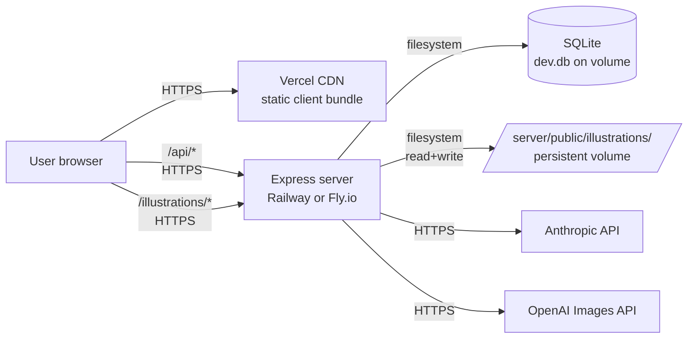
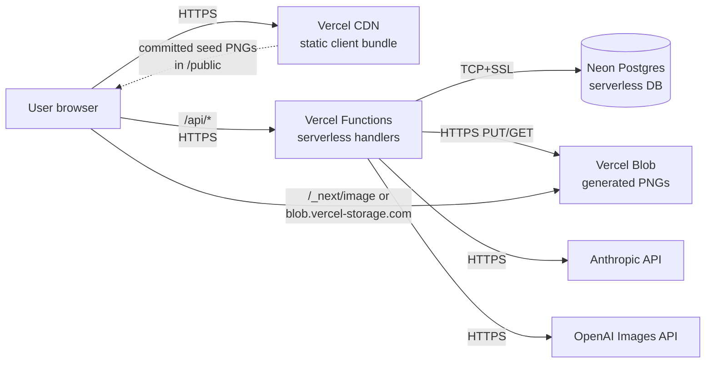

# Deploy Stack Research — Option A vs Option B

**Date:** 2026-05-22
**Status:** Decision-ready research (NOT a commitment to either path)
**Tracks:** [GH #4 — F3: Deploy stack research doc](https://github.com/slickG0ose/storybook/issues/4)
**Milestone:** Foundation
**Output:** Comparison framework + criteria + open questions. The recommendation is yours.

## TL;DR

Two paths to put the StoryBook Storefront in front of users:

- **Option A** — Vercel (client only) + Railway *or* Fly.io (Express + SQLite). Lift-and-shift; minimal code changes.
- **Option B** — Vercel everything + Neon Postgres + Vercel Blob. Forces two code-level swaps (SQLite → Postgres, filesystem PNGs → blob storage).

The brief's "key risk" (Vercel 10s/60s function timeout vs 30–120s image gen) is **outdated** — with Fluid Compute enabled, Hobby is 300s and Pro is up to 800s. Image-gen latency is no longer the deciding factor.

The actual forcing functions are:

1. **Commercial-use clause.** Vercel Hobby is non-commercial only. A storefront that accepts payment (even demo-grade) needs Pro from day one → $20/seat/month minimum on the Vercel side.
2. **Vercel ephemeral filesystem.** Vercel Functions can't write to disk persistently. Option B isn't "Postgres swap" — it's "Postgres swap **plus** blob-storage swap **plus** Express-to-serverless-handler refactor." The brief understates the scope.
3. **Fly.io has no free tier for new orgs** as of October 2024. The Option A "Fly.io" arm is pay-as-you-go from dollar one (~$2/month base + storage + bandwidth).

These don't pick a winner. They reshape the trade-off: A is cheaper and lower-effort; B is the path toward platform consolidation if you intend to grow into Vercel's ecosystem (Blob, Workflows, edge config, etc.).

## Background

StoryBook Storefront today (local dev):

- **`client/`** — React 19 + Vite 8 + Tailwind 4, static-buildable.
- **`server/`** — Express 4 + Prisma + SQLite, single Node process, persistent filesystem.
- **Illustrations** — Generated PNGs persisted to `server/public/illustrations/{book-id}/page-*.png`. Demo seed commits 6 PNGs (~13.7 MB) for "A Spot for Sunny."
- **External APIs** — Anthropic SDK (story gen, sub-30s), OpenAI Images (30–120s per illustration).
- **DB ops** — Prisma migrations, schema is small (users, books, pages, versions, cart, orders, etc.).
- **Auth** — UUID session cookie, no third-party identity provider.

The app is demo-grade today but the foundation milestone exists to put it in front of real (small) audiences. This document evaluates two paths to do that.

## Architecture — Option A (Vercel client + Railway/Fly server)

Lift-and-shift. Zero code changes to `server/`. Only operational change is `DATABASE_URL`, persistent volume mount, and an upstream that proxies `/api/*` to the server host. Long-running OpenAI image-gen calls run as ordinary blocking handlers — no architectural workaround needed.

## Architecture — Option B (Vercel everything + Postgres)

Two persistence boundaries instead of one: **Neon** for relational data, **Vercel Blob** for runtime-generated images. Committed seed PNGs (e.g., the "Sunny" demo book) still ship inside the deploy bundle and serve from CDN — only runtime-created images go to Blob. Express either runs unmodified via `serverless-http` (works but cold-starts each invocation) or is refactored into Vercel Function handlers per route (more native, more work).

## Comparison matrix

| Dimension | Option A (Vercel client + Railway/Fly server) | Option B (Vercel everything + Postgres) |
| --- | --- | --- |
| **Setup time** | Half-day to a day. Add Railway/Fly config, point client at server URL, configure CORS. Volume mount for SQLite + `public/illustrations/`. No app code changes. | 2–5 days. SQLite → Postgres schema migration, Prisma datasource swap, runtime-PNG write paths re-pointed to Blob, Express → serverless adapter, env-var wiring across client/server (no longer same host). |
| **Cost — 0 use** | Vercel Hobby free (client) + Railway Hobby $5/mo OR Fly.io ~$2/mo base. **Floor ~$2–5/mo.** | Vercel Hobby free + Neon free (0.5GB, 100 CU-hr) + Vercel Blob free tier (1GB). **Floor $0/mo.** |
| **Cost — low use** (10 books/mo) | Same as 0 use — within Hobby/Free credits. ~$5/mo. | Same as 0 use — within free tiers. ~$0/mo. |
| **Cost — moderate use** (100 books/mo, 10k page views) | Railway Hobby still likely ~$5–10/mo; Fly likely ~$5–10/mo. Vercel client stays free until 100GB egress. **~$5–10/mo total.** | Vercel Pro **required for commercial use** ($20/seat/mo) + Neon Launch (~$5–10/mo for 600 image gens worth of writes) + Blob ~$5/mo (600 PNGs × 2MB stored + egress). **~$30–35/mo total.** |
| **Lock-in** | Low. Express + SQLite/Postgres + filesystem is portable to any container host (Render, Heroku, self-hosted, etc.). | Medium-high. Vercel Functions handler shape, Vercel Blob SDK, and Neon-specific Postgres extensions all bind you to the Vercel ecosystem. Postgres itself is portable; the handler/blob layer isn't. |
| **Static-asset story** (committed PNGs) | Served by Express via `public/` directory through Railway/Fly. CDN if you front it with Cloudflare. | Committed PNGs in `client/public/` (or moved there) serve from Vercel CDN automatically. Runtime PNGs go to Blob ($0.023/GB-mo + $0.05/GB egress). |
| **Long-running request support** (30–120s image gen) | Native. Express handler awaits the OpenAI call indefinitely. No timeout in Railway/Fly default config. | Vercel Functions w/ Fluid Compute: Hobby 300s, Pro up to 800s. Fits comfortably for a single image. "Illustrate all 6 in parallel" still fits one handler. Sequential serialization of all 6 might brush 300s on Hobby and need Pro. |
| **SQLite → Postgres migration cost** | $0 if Option A keeps SQLite. If you choose to swap anyway (for prod hardening), it's a 1-time Prisma datasource change + migration replay + connection-pooling consideration. | Required up front. Prisma supports both, so the schema is portable, but you'll hit: (a) generated migrations differ between providers (need a fresh `prisma migrate dev` against Postgres), (b) any raw SQL using SQLite quirks (`||` concat, `LIKE` case-sensitivity, lack of arrays, etc.) breaks, (c) need to pick connection-pool strategy (Neon serverless driver vs PgBouncer). |
| **Filesystem write paths** | Works as-is. `server/public/illustrations/{id}/page-N.png` writes succeed on Railway/Fly persistent volume. | **Breaks.** Vercel Functions filesystem is read-only (except `/tmp`, which is ephemeral per-invocation). Every `fs.writeFile` for generated illustrations needs to be re-pointed at Vercel Blob SDK. Affects `server/src/services/illustrations.ts` and any callers. |
| **Commercial-use restriction** | None at Railway/Fly's hobby tiers. | **Vercel Hobby is non-commercial only.** Storefronts that accept payment (Stripe, etc.) require Pro from day one. Donation-only is OK on Hobby. |
| **Cold-start latency** | ~0 — Railway/Fly machines stay warm. (Fly machines can autostop; first request triggers wake, ~1–2s.) | Vercel Functions cold-start typically <500ms with Fluid Compute. Express-via-`serverless-http` adds a layer. Neon's autosuspend after 5 min idle adds ~1–2s on the first DB query post-suspend. |
| **Observability** | Railway + Fly both ship logs, metrics, deploy history. No APM included. | Vercel ships logs + Function traces + deploy history + analytics. Tighter integration than Railway/Fly for a Vercel-first team. |
| **Multi-region** | Railway: single region per service. Fly: easy multi-region. | Vercel Functions: region-first execute (configurable), Enterprise can multi-region. |

### Required-numbers section (primary sources, verified 2026-05-22)

| Number | Value | Source |
| --- | --- | --- |
| Vercel Functions max duration — Hobby (with Fluid Compute) | 300 s (default + max) | [Vercel Functions Limits](https://vercel.com/docs/functions/limitations) |
| Vercel Functions max duration — Pro | 300 s default, 800 s max | [Vercel Functions Limits](https://vercel.com/docs/functions/limitations) |
| Vercel Functions max duration — pre-Fluid-Compute (legacy figure from brief) | Hobby 10 s, Pro 60 s — **no longer current** | [Vercel Functions Limits](https://vercel.com/docs/functions/limitations) |
| Vercel Hobby plan cost | Free; non-commercial only | [Vercel Pricing](https://vercel.com/pricing), [Hobby Plan Terms](https://vercel.com/docs/plans/hobby) |
| Vercel Pro plan cost | $20/user/month + $20 included usage credit | [Vercel Pricing](https://vercel.com/pricing) |
| Vercel Hobby included | 1M edge requests, 100 GB bandwidth, 4 CPU-hours, 360 GB-hr memory, 1M invocations / month | [Vercel Pricing](https://vercel.com/pricing) |
| Vercel Blob storage | $0.023/GB-month | [Vercel Blob Pricing](https://vercel.com/docs/vercel-blob/usage-and-pricing) |
| Vercel Blob egress | $0.05/GB | [Vercel Blob Pricing](https://vercel.com/docs/vercel-blob/usage-and-pricing) |
| Railway Hobby cost | $5/month base + includes $5 usage credit | [Railway Pricing](https://railway.com/pricing) |
| Railway memory rate | $0.000231 per GB-minute (~$0.014/GB-hour) | [Railway Pricing](https://railway.com/pricing) |
| Railway Pro cost | $20/seat/month | [Railway Pricing](https://railway.com/pricing) |
| Fly.io free tier (2026) | **None for new orgs** since 2024-10-07; pay-as-you-go only | [Fly.io Resource Pricing](https://fly.io/docs/about/pricing/) |
| Fly.io shared-cpu-1x 256MB | ~$2.02/month continuous | [Fly.io Resource Pricing](https://fly.io/docs/about/pricing/) |
| Neon free tier | 0.5 GB storage/project, 100 CU-hr/month, 10 branches, autosuspend after 5 min | [Neon Pricing](https://neon.com/pricing) |
| Neon Launch tier | Pay-as-you-go ("no monthly minimum"), up to 16 CU autoscale, 100 GB egress included | [Neon Pricing](https://neon.com/pricing) |

## Critical findings the brief missed or got wrong

1. **The 10s/60s timeout figure is from before Vercel Fluid Compute.** Current Hobby is 300s; Pro is up to 800s. The image-gen latency framing in the brief no longer applies. ([Vercel Functions Limits](https://vercel.com/docs/functions/limitations))

2. **Option B is two swaps, not one.** "Vercel everything + Postgres swap" misses that Vercel Functions can't write the filesystem persistently — every `fs.writeFile` in the runtime illustration pipeline needs to be re-pointed at Vercel Blob (or S3/R2). Affects at minimum `server/src/services/illustrations.ts` and the Express static-file serving for runtime-created PNGs.

3. **Express on Vercel needs an adapter or rewrite.** `serverless-http` makes the existing Express app deployable as a single Vercel Function, but every request boots the Express middleware chain on cold start. The "native" path is rewriting routes as Vercel Function handlers — significant effort against a 12-file route directory. Either approach is non-trivial.

4. **Vercel Hobby = non-commercial only.** If the storefront ever processes a real payment, you need Pro ($20/seat/mo) from day one. Donation-only or "use the product without paying" is OK on Hobby. This single clause flips the moderate-use cost comparison decisively in Option A's favor.

5. **Fly.io is no longer free for new accounts.** The brief implies free-tier viability. As of 2024-10-07, Fly is pay-as-you-go only for new orgs (~$2/mo base + volumes + bandwidth). Still cheap, but not zero.

6. **Neon free tier autosuspends after 5 min idle.** First request after idle wakes the DB in ~1–2 seconds. Acceptable for demos; user-visible for low-traffic prod. Launch tier removes/extends this.

7. **SQLite is fine for the demo tier.** The pressure to swap to Postgres comes from Vercel, not from product requirements. SQLite handles thousands of QPS for read-heavy workloads when on a persistent volume; the storefront's workload is well within that. Don't burn the migration budget unless Option B is chosen.

## Open questions

These are decision inputs only you can answer:

1. **Will the demo accept payment?** If yes (or "yes within 6 months"), Vercel Pro is mandatory; the cost-floor advantage of Option B's free tier evaporates. If no (donation-only or pure showcase), Hobby works on both sides.

2. **Is platform consolidation on Vercel a strategic goal?** Some teams want everything on one bill, one dashboard, one set of secrets. If yes, Option B's migration cost is an investment, not a tax. If no, Option A keeps optionality open.

3. **How patient are you with the SQLite swap?** A Postgres migration is a real chunk of work even with Prisma — and it's a *one-way* migration in practice (no easy rollback once data lives in Postgres). Option A defers this until you actually need it; Option B forces it.

4. **Do you want a long-running worker for image gen?** Both options can run image gen synchronously today (Railway/Fly: no timeout; Vercel: 300s Hobby / 800s Pro). But if you ever want background batch generation, recovery from partial failures, or per-page progress streaming, the architecture diverges. Vercel Workflows (their durable-execution product) is a B-only path; Option A would reach for BullMQ or a separate worker process.

5. **Where does the "demo deploy" sit on the alpha/beta readiness substrate?** F5 (Demo deploy, issue #7) is blocked, presumably on this research. F4a (email allowlist) and F4b (spend gates) are also Foundation Tier 1 — they constrain *who* sees the demo and *how much it can cost you*. The deploy choice should be informed by those constraints, not just by the technical comparison.

6. **What's the realistic 12-month traffic shape?** If you genuinely stay below 100 books/month created across all users, both options are <$15/mo. If a viral moment is possible, the cost lines diverge fast (Vercel Pro + Blob egress at scale vs. Railway Hobby usage credits).

## Recommendation framework

Score each option from 1 (worst) to 5 (best) for each criterion. Multiply by the weight you assign. Highest weighted sum wins. **Weights below are starting points** — adjust them based on what *actually* matters to you, especially after answering the open questions above.

| Criterion | Suggested weight | Why this weight |
| --- | --- | --- |
| Setup time / effort to first deploy | 3 | Foundation milestone is unblocking the demo; the longer this takes, the longer everything else waits. |
| Total monthly cost at expected use | 4 | Storefront is demo-grade, no revenue; you eat this cost yourself. |
| Migration cost (one-time) | 3 | One-shot pain. Heavy if Option B is picked. |
| Lock-in / portability | 2 | Matters if you ever move providers; doesn't matter for a one-shot demo that gets shelved. |
| Operational complexity ongoing | 3 | More moving parts = more incidents = more time spent not building features. |
| Strategic alignment with Vercel ecosystem | ? | Set to 0 if you don't care, 4–5 if Vercel consolidation is the stated direction. |
| Static-asset/blob story | 2 | Demo-grade storage volumes are tiny; matters more at scale. |
| Long-running request support | 1 | Both options can do this in 2026. Was a discriminator pre-Fluid-Compute; isn't anymore. |
| Commercial-use compliance (Vercel TOS) | depends on Q1 | Set to 5 if the demo will ever take a payment; 0 if donation-only or showcase. |
| Time to swap providers later if needed | 2 | Option A's lower lock-in compounds the longer the project lives. |

### Worked example — "demo-grade showcase, no payments, want it cheap, want it soon"

If Q1=no payment, Q2=no Vercel-strategy, Q3=defer migration, the weights skew to setup time, cost, migration cost — every one of which favors Option A. Plug those in and Option A wins by a wide margin.

### Worked example — "this is the production substrate, paying customers within 6 months, all-in on Vercel"

Q1=yes payment, Q2=consolidate on Vercel, Q3=invest in migration now. Setup time and migration cost weigh against B; lock-in concern is dampened by intentional alignment; commercial-use compliance is irrelevant because Pro is mandatory either way. The cost gap shrinks since both need paid tiers. Option B becomes competitive.

The framework doesn't pick the winner — your weights do.

## Risks and mitigations

| Risk | Probability | Impact | Mitigation |
| --- | --- | --- | --- |
| Vercel Hobby TOS strike (commercial use detection) | Medium if any payment surface exists | Project disabled without notice | Move to Pro before adding any payment flow, even test-mode |
| SQLite-on-volume corruption (Railway/Fly) | Low | High | Daily volume snapshot (Fly volumes do this; Railway needs manual sidecar). Already have `server/src/db/snapshot.ts` for local — extend to prod. |
| Neon free-tier autosuspend hurts demo UX | High at very-low traffic | Low (1–2s wake delay) | Launch tier (~$5/mo) or accept the delay for the demo |
| OpenAI image-gen hits Vercel function timeout | Low (fits in 300s Fluid) | Medium (request fails) | Already-shipped `AbortController` 120s timeout + global error handler (PR #33) catches this. Worth re-validating after deploy. |
| Vercel Function cold-start adds Express boot time per invocation | Medium | Low | Use Fluid Compute (default); rewrite hot routes as native handlers if measured to matter |
| Cost surprise on Option B at moderate scale | Medium | Medium ($30–50/mo) | F4b spend gates issue #6 covers this at the app layer; provider-level budget alarms cover the platform layer |
| Migration regret on Option B if traffic stays low | Medium | Medium (sunk cost on the SQLite swap) | Make the migration reversible by keeping a Prisma SQLite branch maintained for local dev (already true) |

## Further research needed before deciding

1. **Confirm Vercel Workflows fits image-gen long jobs** — if Option B and you want background batch generation, validate the workflow model against the existing illustrate-all flow.
2. **Spike a Railway deploy as a half-day timeboxed experiment** — concrete numbers on cold-start, volume mount UX, and whether the current `npm run build` + start command works unmodified.
3. **Spike a Vercel Functions deploy of one Express route** — concrete numbers on cold-start, `serverless-http` adapter friction, env-var wiring.
4. **Confirm the Foundation milestone's payment-handling intent** (#5 F4a email allowlist + #6 F4b spend gates) before committing — Q1 above is the swing vote.

## Sources

- Vercel docs — [Vercel Functions Limits](https://vercel.com/docs/functions/limitations) (last_updated 2026-02-24)
- Vercel docs — [Vercel Pricing](https://vercel.com/pricing)
- Vercel docs — [Hobby Plan](https://vercel.com/docs/plans/hobby), [Fair Use Guidelines](https://vercel.com/docs/limits/fair-use-guidelines)
- Vercel docs — [Vercel Blob Pricing](https://vercel.com/docs/vercel-blob/usage-and-pricing)
- Vercel docs — [Fluid Compute](https://vercel.com/docs/fluid-compute)
- Vercel KB — [Is SQLite supported in Vercel?](https://vercel.com/kb/guide/is-sqlite-supported-in-vercel)
- Railway docs — [Railway Pricing](https://railway.com/pricing) and [Railway Pricing Docs](https://docs.railway.com/pricing)
- Fly.io docs — [Resource Pricing](https://fly.io/docs/about/pricing/)
- Fly.io docs — [Fly.io Pricing Calculator](https://fly.io/calculator)
- Neon docs — [Neon Pricing](https://neon.com/pricing)
- Anthropic — internal context from `CLAUDE.md` (app stack, illustration path conventions, F3/F4/F5 milestone context)

## Appendix — what changed since the issue was written

The original brief (2026-05-22 morning) framed the key risk as "Vercel Functions Hobby has 10s timeout, Pro has 60s." That was true as of the pre-2025 limits. By the time this research ran (2026-05-22 evening), Vercel's docs (last_updated 2026-02-24) show Fluid-Compute defaults of 300s on Hobby and up to 800s on Pro. The brief's framing should be updated when this PR merges; replace it with the real forcing functions (filesystem ephemerality, commercial-use clause, Fly.io free-tier removal).
